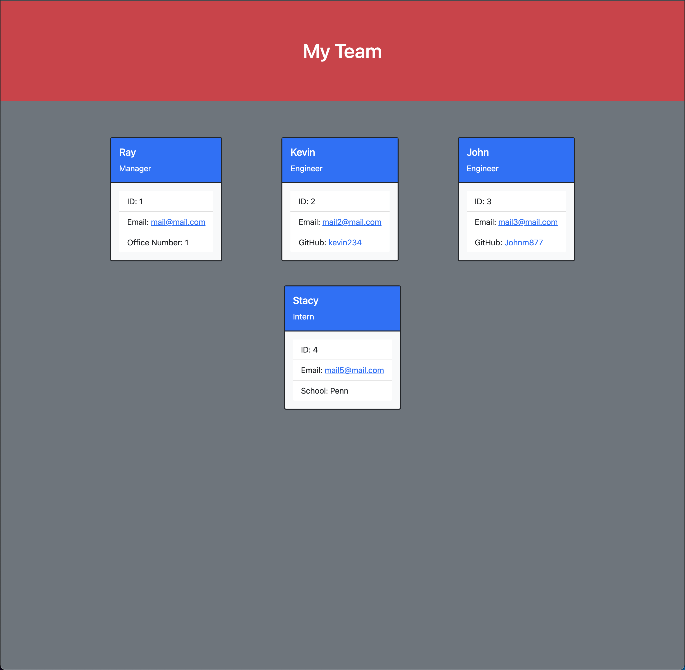

# Team-Generator

## Description
a Node.js command-line application that takes in information about employees on a team, then generates an HTML webpage that displays summaries for each person.

 
             
## Table of Contents
          
 - [Installation](#installation)
 - [Usage](#usage)
 - [Credits](#credits)
 - [License](#license)
 - [Questions](#quesions)
      
## Installation
 fork project from GetHub 
 https://github.com/Rayman244/Team-Generator
      
## Usage
go to the link to view the walkthrough https://drive.google.com/file/d/1qwiBluaWTonBdSPH-GVCJ7BU9GaFoVQ0/view?usp=sharing

## Credits
 Penn Coding BootCamp
      
## License
 MIT License

Copyright (c) 2022
    
Permission is hereby granted, free of charge, to any person obtaining a copy
of this software and associated documentation files (the "Software"), to deal
in the Software without restriction, including without limitation the rights
to use, copy, modify, merge, publish, distribute, sublicense, and/or sell
copies of the Software, and to permit persons to whom the Software is
furnished to do so, subject to the following conditions:
   
The above copyright notice and this permission notice shall be included in all
copies or substantial portions of the Software.
    
THE SOFTWARE IS PROVIDED "AS IS", WITHOUT WARRANTY OF ANY KIND, EXPRESS OR
IMPLIED, INCLUDING BUT NOT LIMITED TO THE WARRANTIES OF MERCHANTABILITY,
FITNESS FOR A PARTICULAR PURPOSE AND NONINFRINGEMENT. IN NO EVENT SHALL THE
AUTHORS OR COPYRIGHT HOLDERS BE LIABLE FOR ANY CLAIM, DAMAGES OR OTHER
LIABILITY, WHETHER IN AN ACTION OF CONTRACT, TORT OR OTHERWISE, ARISING FROM,
OUT OF OR IN CONNECTION WITH THE SOFTWARE OR THE USE OR OTHER DEALINGS IN THE
SOFTWARE.
            
## Badges

      
## Features
  - create Managers,Engineers,and Employees. 
  - Creates HTML and CSS files 
 
## How to Contribute
 https://github.com/Rayman244/Team-Generator

      
## Tests
 Testing with jest: all results passed
 to run tests:
  In the terminal run npm i and then npm run test     
  
 ## Questions
 message me on Github https://github.com/Rayman244/
 email me at [rayhewitt42@icloud.com](mailto:rayhewitt42@icloud.com)
 
 